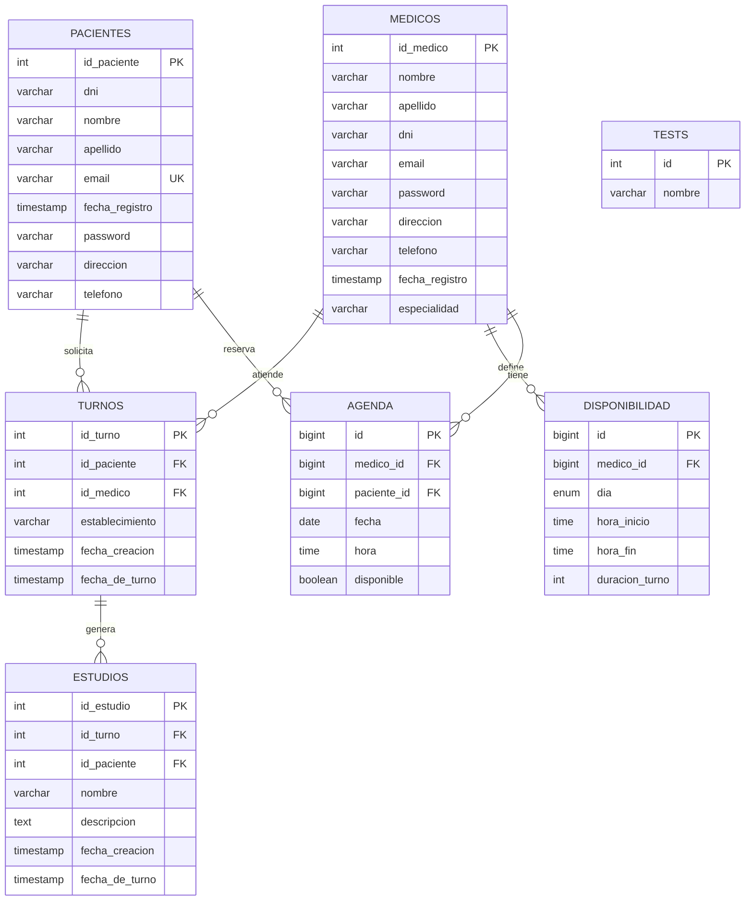

# DER - Sistema de Laboratorio

Este diagrama esta basado en el modelo actual del sistema: entidades JPA del backend y tablas declaradas en `schema.sql`.

## Relaciones

| Relacion | Cardinalidad | Descripcion |
|---|---:|---|
| `PACIENTES` -> `TURNOS` | 1:N | Un paciente puede tener muchos turnos. |
| `MEDICOS` -> `TURNOS` | 1:N | Un medico puede atender muchos turnos. |
| `TURNOS` -> `ESTUDIOS` | 1:N | Un turno puede generar uno o mas estudios. |
| `MEDICOS` -> `DISPONIBILIDAD` | 1:N | Un medico puede definir varios bloques de disponibilidad. |
| `MEDICOS` -> `AGENDA` | 1:N | Un medico puede tener muchas entradas de agenda. |
| `PACIENTES` -> `AGENDA` | 1:N | Un paciente puede reservar varias entradas de agenda. |

## Notas

- `Usuario` no aparece como tabla porque en Java esta definido como `@MappedSuperclass`; sus campos se heredan en `Medico` y `Paciente`.
- `TESTS` queda como entidad independiente porque no tiene claves foraneas.
- `Agenda` y `Disponibilidad` existen como entidades Java. Si se usa `schema.sql` con `spring.jpa.hibernate.ddl-auto=none`, conviene agregar sus `CREATE TABLE` para que queden persistidas en H2.
